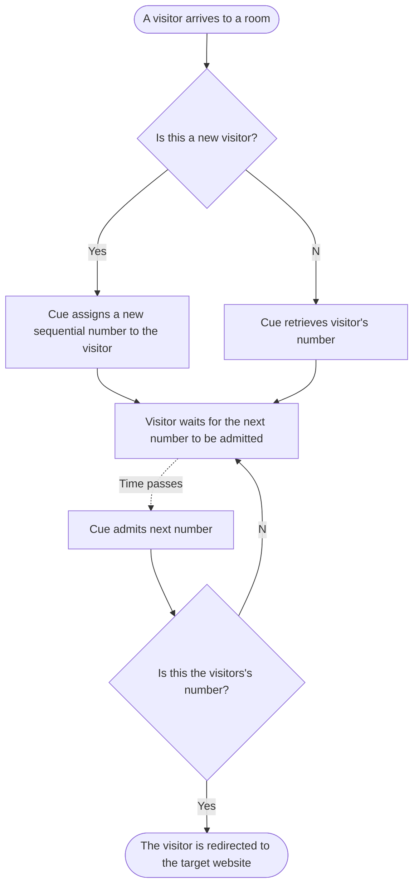

# Cue: Architecture

## Terminology

* *Room*: a virtual waiting room, a place where visitors wait for being admitted to the target website.
* *Visitor*: a person trying to access target website, usually represented with UUID.
* *Target website*: a website that visitors are trying to reach, this is what Cue is protecting.
* *Visitor number*: a sequential number that visitors get when they join the room.

## General user flow

1. A visitor arrives on a room page
2. The visitor joins the room and is assigned a number (or their old number is retrieved)
3. As the time passes visitors are admitted sequentially according to their numbers
4. When a visitor is admitted, they get redirected to the target website

Following diagram ties to illustrate this flow:

