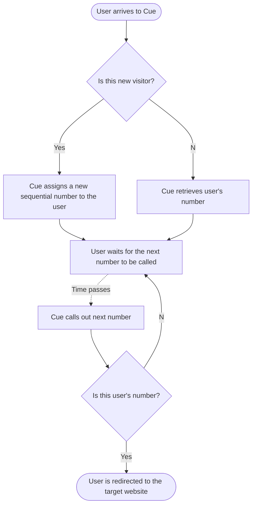

# Cue: Architecture

## General user flow

1. A user arrives to Cue
2. Cue assigns a sequential number to the user (or retrieves their old number)
3. Time passes and Cue "calls out" numbers sequentially
4. A user with "called out" number gets redirected to the target URL

Following diagram ties to illustrate this flow:

